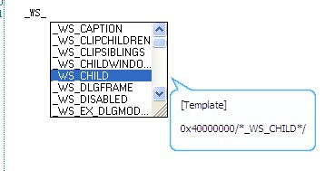

# win库

win库主要提供windows系统函数、本进程窗口操作函数。外部窗口管理参考扩展库：[winex](libraries/std/winex)

## :: 操作符使用约定

请参考：[变量、常量](the%20language/variables%20constants)

aardio标准规范约定，仅在win标准库中使用::前缀定义WINAPI函数，结构体为全局常量对象。
并添加智能提示。如果你在编辑器中输出::出现的winapi对象(函数、结构体)，应当能在win库找到、并且只应当在win库找到。

在自行添加WINAPI函数时，不应当使用::前缀并使之成为全局API函数。而应当置于各自的名字空间内。

当然，这仅仅是为了规范化而制定的约定，并非强制规则。

## WINAPI 普通常量

请参考：[变量、常量](the%20language/variables%20constants)

win名字空间所有库用到的API常量，在win.constants中定义为智能提示模板。
这些常量的标识符以下划线开始、并全部大写，在编辑器中输入下划线可以看到你需要的WINAPI常量。



回车可自动转换为数值加注释的形式、并添加到代码中。

请参考：[变量、常量](the%20language/variables%20constants)

## 发送消息

win库定义了以下发送消息的函数：

``` aau
::PostMessage = user32.api("PostMessageA","int(int hWnd,INT msg
    ,int wParam,int lParam)")

::PostThreadMessage = user32.api("PostThreadMessageA","int(int idThread,INT msg
    ,int wParam,int lParam)");

::SendMessage = user32.api("SendMessageA","int(int hWnd,INT msg
    ,pointer wParam,pointer lParam)")

::SendMessageInt = user32.api("SendMessageA","int(int hWnd,INT msg
    ,int wParam,int lParam)")

::SendMessageByString = user32.api("SendMessageA","int(int,INT,int
    ,int wParam,string &lParam)")

::SendMessageByStruct = user32.api("SendMessageA","int(int hWnd,INT msg
    ,int wParam,struct &lParam)")
```

以上重载了SendMessageA函数的多个版本，请参考：[重载API函数](libraries/kernel/raw/overload)

除 PostThreadMessage函数的第一个参数为线程ID外，其他发送消息函数第一个参数为窗口句柄。
而第二个参数为消息ID（数值），第三、第四个参数随消息不同而有不同的含义和用法。

SendMessage系列函数是阻塞性的，即等待消息接收、处理完毕并返回以后才返回执行后面的代码。
Post系列的消息发送函数是非阻塞的，发送消息以后就立即返回，不会等待消息处理完毕。


## win.lasterr

**1、函数原型：**

``` aau
errcode,errmessage = win.lasterr()
```

**2、函数说明：**

返回WINAPI函数最后一次发生的错误、以及错误信息。

**3、调用示例：**

``` aau
assertf( win.lasterr() ) //反断言函数在win.lasterr()函数返回错误代码非零时抛出异常
```


 请参考： [assertf](kernel%20functions/error%20handling/assert)

## win.msgbox

**1、函数原型：**

``` aau
win.msgbox( 消息,标题,样式,父窗口 )
```

**2、函数说明：**

除第一个参数以外，其他参数可选。样式默认为 0x2000/*_MB_TASKMODAL*/
关于样式，请参考：《 aardio WINAPI使用手册 》中的 MessageBox 函数

注意win.msgbox弹出的窗口默认是没有父窗口的，
这就导致用户可以在任务栏切换其他窗口到弹出的消息对话框前面，而消息对话框又阻塞了线程，
导致前置的窗口不能响应用户的任何操作。

win.form类创建的对象提供msgbox成员函数，该函数可自动指定父窗口。
因此在窗体中，推荐使用窗体对象的的msgbox函数。
** 如下：**

``` aau
import win.ui;

/*DSG{{*/
var winform = win.form(parent=...; min=1;bottom=249;max=1;text="aardio Form";right=349 )
winform.add(
button={ bottom=131;text="button";left=110;right=219;top=79;z=0;cls="button" }
)
/*}}*/

winform.button.oncommand = function(id,event){
	winform.msgbox("你不可能把我折腾到父窗体后面去")
}

winform.show(true)
win.loopMessage();
```

## win.msgboxTest

**1、函数原型：**

``` aau
ok = win.msgboxTest( 消息,标题,父窗口 )
```

**2、函数说明：**

除第一个参数外，其他参数可选，该函数调用win.msgbox弹出一个带确定按钮、取消按钮的询问对话框，如果用户按确定返回true，否则返回false。 

**3、函数定义：**

``` aau
msgboxTest = function(str,title ,parenthwnd=0){
	return msgbox(str,title,0x1 | 0x20 /*_MB_OKCANCEL|_MB_ICONQUESTION*/ ,parenthwnd ) == 1;
}
```

## win.find

**1、函数原型：**

``` aau
hwnd = win.find( 类名,标题 )
```

 注意：本文档中 hwnd 用于表示窗口句柄的变量名。

**2、函数说明：**

按类名与标题查找指定的窗口，类名与标题都是可选参数。
win.find使用完全匹配来查找类名、标题，如果需要模糊匹配，请使用 [winex.find](libraries/std/winex/winex#find)

**3、调用示例：**

``` aau
import process;
import win;

//运行记事本
process.execute("notepad.exe")

//打开控制台
io.open()

//查找窗口
var hwnd = win.find("Notepad");
io.print("找到类名为Notepad的窗口,句柄：", hwnd )
```

## win.findEx

**1、函数原型：**

``` aau
hwnd = win.findEx( 父窗口句柄,前一个同级窗口句柄,类名,标题 )
```


**2、函数说明：**

 按类名与标题在指定的父窗口查找子窗口，
 前一个同级窗口句柄可以指定为零表示从第一个子窗口开始查找。

 类名与标题都是可选参数。
win.findEx使用完全匹配来查找类名、标题，如果需要模糊匹配以及更强大的查找功能，请使用  [winex.findEx](libraries/std/winex/winex#findEx)

**3、调用示例：**


``` aau
import process;
import win;

//运行记事本
process.execute("notepad.exe")

//打开控制台
io.open()

//查找窗口
var hwnd = win.find("Notepad");
var hedit = win.findEx(hwnd,0,"Edit");

io.print("找到记事本中的文本框句柄：", hedit )
```

## win.loopMessage

**1、函数原型：**

``` aau
win.loopMessage(observer ,attach=true)
```


**2、函数说明：**

win.loopMessage启动窗口消息循环。

Windows是以消息驱动的操作系统，Windows 消息提供了应用程序与应用程序以及应用程序与Windows系统之间进行通讯的手段。 Windows 中有一个系统消息队列，对于每一个正在执行的Windows应用程序,系统为其建立一个"消息队列"，即应用程序消息队列，用来存放该程序可能创建的各种窗口的消息。

在aardio窗口程序中，调用win.loopMessage启动窗口消息循环，用来从程序的消息队列中检索窗口消息并把它们分发到相应的窗口函数中。 "消息循环",实际也就是是程序循环，win.loopMessage退出，则窗口程序终止。

当我们用鼠标、按键等在窗口上操作时，windows就会将相应的操作转换为消息并加入到消息队列中。
而win.loopMessage就检索这些消息并将之分发给窗口函数（消息回调函数wndproc、以及事件函数oncommand）

在一个GUI线程(窗口线程)中只能启动一次win.loopMessage循环，重复调用win.loopMessage不会启动多个循环。
默认win.loopMessage是不需要参数的。

当我们指定observer参数为一个函数时，则win.loopMessage将该函数注册成为消息观察者。
每次从消息队列中取出消息时，win.loopMessage首先会通知所有的observer(消息观察者)。
如果调用 win.loopMessage( observer,false ) ，则将消息观察者observer从观察队列中注销。

**3、调用示例：**

``` aau
import win.ui;
/*DSG{{*/
var winform = win.form(min=1;bottom=249;max=1;text="aardio Form";right=349 )
winform.add(
    button={ bottom=143;text="button";left=119;right=239;top=108;z=0;cls="button" }
)
/*}}*/

winform.show(true)

//打开控制台
io.open()

//创建一个消息观察者
observer = function(msg){
	//msg参数是一个 ::MSG 结构体
	io.print( msg.message )
}

//创建消息循环，如果去掉下面这句，窗口就会直接关闭退出
win.loopMessage(observer);
```

## win.pumpMessage

**1、函数原型：**

``` aau
win.pumpMessage()
```


**2、函数说明：**

等待并处理下一个消息，如果没有消息就一直等待。
win.pumpMessage不会象win.delay那样计时，也不会象 win.loopMessage那样循环执行。 

实际上除了用户操作以外，窗口也会频繁的发生各种内部消息，例如窗口重绘等消息，所以一般情况下，win.pumpMessage会较快的返回，如果在循环中希望响应用户操作，可以使用win.pumpMessage来替代win.delay。

## win.closed

这个属性在运行窗口程序时为false，退出所有窗口程序时为true，可以用来判断窗口程序是否终止。

## win.getDesktop

**1、函数原型：**

``` aau
hwnd = win.getDesktop()
```


**2、函数说明：**

获取桌面窗口句柄，桌面窗口是桌面上所有窗口的父窗口。在很多函数中也可以用0来表示桌面窗口句柄。

## win.getActive

**1、函数原型：**

``` aau
hwnd = win.getActive()
```


**2、函数说明：**

获取当前线程激活窗口句柄,如果要获取全局激活窗口请使用win.getForeground()

## win.setActive

**1、函数原型：**

``` aau
win.setActive(hwnd)
```


**2、函数说明：**

设置激活窗口句柄

## win.getForeground

**1、函数原型：**

``` aau
hwnd = win.getForeground()
```


**2、函数说明：**

获取前台窗口句柄，指当前用户正在使用的顶层窗口。

## win.setForeground

**1、函数原型：**

``` aau
win.setForeground(hwnd)
```


**2、函数说明：**

激活指定窗口到前台。

## win.getFocus

**1、函数原型：**

``` aau
hwnd = win.getFocus()
```


**2、函数说明：**

获取当前线程输入焦点所在的控件句柄，[winex.getFocus](libraries/std/winex/winex#getFocus) 函数可以支持外部线程。

## win.setFocus

**1、函数原型：**

``` aau
win.setFocus(hwnd)
```


**2、函数说明：**

将句柄hwnd指定的窗口设庄输入焦点，此函数只能用于当前线程。外部线程请winex.attach() 以后调用 win.setFocus(hwnd)。

## win.setTop

**1、函数原型：**

``` aau
win.setTop(hwnd)
```


**2、函数说明：**

将窗口设置到当然线程Z序顶部（即最前面），注意win.setForeground是设置到全局Z序的顶部。

## win.setTopmost

**1、函数原型：**

``` aau
win.setTopmost( hwnd,topmost=true )
```


**2、函数说明：**

将hwnd指定句柄的窗口设置为始终在最前，即保持不被其他窗口覆盖。

## win.getThreadProcessId

**1、函数原型：**

``` aau
var tid,pid = win.getThreadProcessId( hwnd )
```


**2、函数说明：**

返回指定窗口的线程ID,进程ID

## win.getClass

**1、函数原型：**

``` aau
classname = win.getClass(hwnd)
```


**2、函数说明：**

返回窗口类名

## win.getId

**1、函数原型：**

``` aau
ctrlId = win.getId(hwnd)
```


**2、函数说明：**

返回控件ID

## win.getText

**1、函数原型：**

``` aau
text = win.getText( hwnd,缓冲区长度=文本长度 )
```


**2、函数说明：**

返回控件文本内容，可以指定缓冲区长度，也可以不指定长度，由win.getText自动获取文本长度并分配合适的缓冲区。

## win.setText

**1、函数原型：**

``` aau
win.setText(hwnd,文本)
```


**2、函数说明：**

设置控件文本

## win.getTextById

**1、函数原型：**

``` aau
text = win.getTextById(hwnd,id,len=256)
```


**2、函数说明：**

在hwnd指定句柄的窗口上查找指定id的控件，并返回文本，len指定缓冲区长度，默认为256个字节。

## win.setTextById

**1、函数原型：**

``` aau
win.setTextById( hwnd,id,文本)
```


**2、函数说明：**

在hwnd指定句柄的窗口上为指定id的控件设置文本。

## win.getParent

**1、函数原型：**

``` aau
parent = win.getParent( hwnd )
```


**2、函数说明：**

获取父窗口句柄

## win.setParent

**1、函数原型：**

``` aau
win.setParent( 子窗口句柄,父窗口句柄 )
```


**2、函数说明：**

为第一个参数指定的窗口设定父窗口。

## win.getRoot

**1、函数原型：**

``` aau
hwndroot = win.getRoot( hwnd )
```


**2、函数说明：**

此函数递归调用win.getParent获取一个窗口的最顶层父窗口。

## win.enable

**1、函数原型：**

``` aau
win.enable( hwnd , 1 ) //启用窗口
win.enable( hwnd , 0 ) //禁用窗口
```


**2、函数说明：**

启用或禁用指定窗口

## win.getenv

**1、函数原型：**

``` aau
env = win.getenv( 环境变量名 )
```


**2、函数说明：**

返回环境变量.

**3、函数示例**

``` aau
import win;
io.print( io.print(   win.getenv( "TEMP" ) )
```

## win.setenv

**1、函数原型：**

``` aau
win.setenv( 环境变量名,值 )
```


**2、函数说明：**

设置环境变量.
