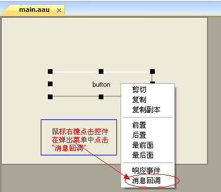
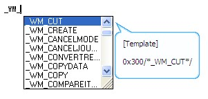

消息，就是指Windows发出的一个通知，告诉应用程序某个事情发生了。例如，单击鼠标、改变窗口尺寸、按下键盘上的一个键都会使Windows发送一个消息给应用程序。消息本身是作为一个记录传递给应用程序的，这个记录中包含了消息的类型以及其他信息。例如，对于单击鼠标所产生的消息来说，这个记录中包含了单击鼠标时的坐标。

|

**消息范围**  |

**表示**  |
|

0 ~ WM_USER–1  |

操作系统保留的消息。  |
|

**WM_USER**~ 0x7FFF  |

私有窗口级别的自定义消息。  |
|

**WM_APP**~ 0xBFFF  |

应用程序级别的自定义消息。其中0xAAAA/*_WM_AARDIO_RESERVED*/ 至 0xBFFF 为aardio标准库保留值请勿使用。  |
|

0xC000 ~ 0xFFFF  |

::RegisterWindowMessage函数定义一个新的窗口消息，该消息保证在整个系统范围内是唯一的。  |
|

0xFFFF ~  |

操作系统保留的消息。  |

 对于一般的点按控件的用户操作，通过创建事件响应函数就可以处理了。
 在窗体设计器里，直接双击控件，就可以创建该控件的oncommand函数（也就是用户点按这个控件时会触发的函数。

 如果你需要进一步拦截所有消息，在aardio里，非常的简单。
 请看下面的动画过程。

 在消息回调函数里，可以处理控件或窗口的所有消息。

 对于主窗体：同样是在右键菜单中点击【创建窗口消息回调函数】，如下：

|
> winform.wndproc =  |

wparam 通常是一个与消息有关的常量值，也可能是窗口或控件的句柄。
lparam 通常是一个指向内存中数据的32位指针。
            根据不同的消息，他们有不同的意义，例如在鼠标右键弹起消息里，::LOWORD(lparam)取lparam的低位表示x坐标,
            ::HIWORD(lparam)取出lparam的高位表示y坐标.

hwnd 32位的窗口句柄。 一般我们不用管这个参数。
message 用于区别其他消息的常量值，这些常量值通常以下划线开头，或_WM_开头

 _WM_NULL = 0x0000;
 _WM_CREATE = 0x0001;
 应用程序创建一个窗口

 _WM_DESTROY = 0x0002;
 一个窗口被销毁

 _WM_MOVE = 0x0003;
 移动一个窗口

 _WM_SIZE = 0x0005;
 改变一个窗口的大小

 _WM_ACTIVATE = 0x0006;
 一个窗口被激活或失去激活状态；

 _WM_SETFOCUS = 0x0007;
 获得焦点后

 _WM_KILLFOCUS = 0x0008;
 失去焦点

 _WM_ENABLE = 0x000A;
 改变enable状态

 _WM_SETREDRAW = 0x000B;
 设置窗口是否能重画

 _WM_SETTEXT = 0x000C;
 应用程序发送此消息来设置一个窗口的文本

 _WM_GETTEXT = 0x000D;
 应用程序发送此消息来复制对应窗口的文本到缓冲区

 _WM_GETTEXTLENGTH = 0x000E;
 得到与一个窗口有关的文本的长度（不包含空字符）

 _WM_PAINT = 0x000F;
 要求一个窗口重画自己

 _WM_CLOSE = 0x0010;
 当一个窗口或应用程序要关闭时发送一个信号

 _WM_QUERYENDSESSION = 0x0011;
 当用户选择结束对话框或程序自己调用ExitWindows函数

 _WM_QUIT = 0x0012;
 用来结束程序运行或当程序调用postquitmessage函数

 _WM_QUERYOPEN = 0x0013;
 当用户窗口恢复以前的大小位置时，把此消息发送给某个图标

 _WM_ERASEBKGND = 0x0014;
 当窗口背景必须被擦除时（例在窗口改变大小时）

 _WM_SYSCOLORCHANGE = 0x0015;
 当系统颜色改变时，发送此消息给所有顶级窗口

 _WM_ENDSESSION = 0x0016;
 当系统进程发出_WM_QUERYENDSESSION消息后，此消息发送给应用程序，
 通知它对话是否结束

 _WM_SYSTEMERROR = 0x0017;

 _WM_SHOWWINDOW = 0x0018;
 当隐藏或显示窗口是发送此消息给这个窗口

 _WM_ACTIVATEAPP = 0x001C;
 发此消息给应用程序哪个窗口是激活的，哪个是非激活的；

 _WM_FONTCHANGE = 0x001D;
 当系统的字体资源库变化时发送此消息给所有顶级窗口

 _WM_TIMECHANGE = 0x001E;
 当系统的时间变化时发送此消息给所有顶级窗口

 _WM_CANCELMODE = 0x001F;
 发送此消息来取消某种正在进行的摸态（操作）

 _WM_SETCURSOR = 0x0020;
 如果鼠标引起光标在某个窗口中移动且鼠标输入没有被捕获时，就发消息给某个窗口

 _WM_MOUSEACTIVATE = 0x0021;
 当光标在某个非激活的窗口中而用户正按着鼠标的某个键发送此消息给当前窗口

 _WM_CHILDACTIVATE = 0x0022;
 发送此消息给MDI子窗口当用户点击此窗口的标题栏，或当窗口被激活，移动，改变大小

 _WM_QUEUESYNC = 0x0023;
 此消息由基于计算机的训练程序发送，通过WH_JOURNALPALYBACK的hook程序
 分离出用户输入消息

 _WM_GETMINMAXINFO = 0x0024;
 此消息发送给窗口当它将要改变大小或位置；

 _WM_PAINTICON = 0x0026;
 发送给最小化窗口当它图标将要被重画

 _WM_ICONERASEBKGND = 0x0027;
 此消息发送给某个最小化窗口，仅当它在画图标前它的背景必须被重画

 _WM_NEXTDLGCTL = 0x0028;
 发送此消息给一个对话框程序去更改焦点位置

 _WM_SPOOLERSTATUS = 0x002A;
 每当打印管理列队增加或减少一条作业时发出此消息

 _WM_DRAWITEM = 0x002B;
 当button，combobox，listbox，menu的可视外观改变时发送
 此消息给这些空件的所有者

 _WM_MEASUREITEM = 0x002C;
 当button, combo box, list box, list view control, or menu item 被创建时
 发送此消息给控件的所有者

 _WM_DELETEITEM = 0x002D;
 当the list box 或 combo box 被销毁 或 当 某些项被删除通过
LB_DELETESTRING, LB_RESETCONTENT, CB_DELETESTRING, or CB_RESETCONTENT 消息

 _WM_VKEYTOITEM = 0x002E;
 此消息有一个LBS_WANTKEYBOARDINPUT风格的发出给它的所有者来响应

 _WM_KEYDOWN消息

 _WM_CHARTOITEM = 0x002F;
 此消息由一个LBS_WANTKEYBOARDINPUT风格的列表框发送给他的所有者来响应_WM_CHAR消息

 _WM_SETFONT = 0x0030;
 当绘制文本时程序发送此消息得到控件要用的颜色

 _WM_GETFONT = 0x0031;
 应用程序发送此消息得到当前控件绘制文本的字体

 _WM_SETHOTKEY = 0x0032;
 应用程序发送此消息让一个窗口与一个热键相关连

 _WM_GETHOTKEY = 0x0033;
 应用程序发送此消息来判断热键与某个窗口是否有关联

 _WM_QUERYDRAGICON = 0x0037;
 此消息发送给最小化窗口，当此窗口将要被拖放而它的类中没有定义图标，应用程序能返回一个图标或光标的句柄，当用户拖放图标时系统显示这个图标或光标

 _WM_COMPAREITEM = 0x0039;
 发送此消息来判定combobox或listbox新增加的项的相对位置

 _WM_GETOBJECT = 0x003D;

 _WM_COMPACTING = 0x0041;
 显示内存已经很少了

 _WM_WINDOWPOSCHANGING = 0x0046;
 发送此消息给那个窗口的大小和位置将要被改变时，来调用setwindowpos函数或其它窗口管理函数

 _WM_WINDOWPOSCHANGED = 0x0047;
 发送此消息给那个窗口的大小和位置已经被改变时，来调用setwindowpos函数或其它窗口管理函数

 _WM_POWER = 0x0048;（适用于16位的windows）
 当系统将要进入暂停状态时发送此消息

 _WM_COPYDATA = 0x004A;
 当一个应用程序传递数据给另一个应用程序时发送此消息

 _WM_CANCELJOURNAL = 0x004B;
 当某个用户取消程序日志激活状态，提交此消息给程序

 _WM_NOTIFY = 0x004E;
 当某个控件的某个事件已经发生或这个控件需要得到一些信息时，发送此消息给它的父窗口

 _WM_INPUTLANGCHANGEREQUEST = 0x0050;
 当用户选择某种输入语言，或输入语言的热键改变

 _WM_INPUTLANGCHANGE = 0x0051;
 当平台现场已经被改变后发送此消息给受影响的最顶级窗口

 _WM_TCARD = 0x0052;
 当程序已经初始化windows帮助例程时发送此消息给应用程序

 _WM_HELP = 0x0053;
 此消息显示用户按下了F1，如果某个菜单是激活的，就发送此消息个此窗口关联的菜单，否则就发送给有焦点的窗口，如果当前都没有焦点，就把此消息发送给当前激活的窗口

 _WM_USERCHANGED = 0x0054;
 当用户已经登入或退出后发送此消息给所有的窗口，当用户登入或退出时系统更新用户的具体设置信息，在用户更新设置时系统马上发送此消息；

 _WM_NOTIFYFORMAT = 0x0055;
 公用控件，自定义控件和他们的父窗口通过此消息来判断控件是使用ANSI还是UNICODE结构在_WM_NOTIFY消息，使用此控件能使某个控件与它的父控件之间进行相互通信

 _WM_CONTEXTMENU = 0x007B;
 当用户某个窗口中点击了一下右键就发送此消息给这个窗口

 _WM_STYLECHANGING = 0x007C;
 当调用SETWINDOWLONG函数将要改变一个或多个 窗口的风格时发送此消息给那个窗口

 _WM_STYLECHANGED = 0x007D;
 当调用SETWINDOWLONG函数一个或多个 窗口的风格后发送此消息给那个窗口

 _WM_DISPLAYCHANGE = 0x007E;
 当显示器的分辨率改变后发送此消息给所有的窗口

 _WM_GETICON = 0x007F;
 此消息发送给某个窗口来返回与某个窗口有关连的大图标或小图标的句柄；

 _WM_SETICON = 0x0080;
 程序发送此消息让一个新的大图标或小图标与某个窗口关联；

 _WM_NCCREATE = 0x0081;
 当某个窗口第一次被创建时，此消息在_WM_CREATE消息发送前发送；

 _WM_NCDESTROY = 0x0082;
 此消息通知某个窗口，非客户区正在销毁

 _WM_NCCALCSIZE = 0x0083;
 当某个窗口的客户区域必须被核算时发送此消息

 _WM_NCHITTEST = 0x0084;//移动鼠标，按住或释放鼠标时发生

 _WM_NCPAINT = 0x0085;
 程序发送此消息给某个窗口当它（窗口）的框架必须被绘制时；

 _WM_NCACTIVATE = 0x0086;
 此消息发送给某个窗口 仅当它的非客户区需要被改变来显示是激活还是非激活状态；

 _WM_GETDLGCODE = 0x0087;
 发送此消息给某个与对话框程序关联的控件，widdows控制方位键和TAB键使输入进入此控件
            通过响应_WM_GETDLGCODE消息，应用程序可以把他当成一个特殊的输入控件并能处理它

 _WM_NCMOUSEMOVE = 0x00A0;
 当光标在一个窗口的非客户区内移动时发送此消息给这个窗口 //非客户区为：窗体的标题栏及窗

 的边框体

 _WM_NCLBUTTONDOWN = 0x00A1;
 当光标在一个窗口的非客户区同时按下鼠标左键时提交此消息

 _WM_NCLBUTTONUP = 0x00A2;
 当用户释放鼠标左键同时光标某个窗口在非客户区十发送此消息；

 _WM_NCLBUTTONDBLCLK = 0x00A3;
 当用户双击鼠标左键同时光标某个窗口在非客户区十发送此消息

 _WM_NCRBUTTONDOWN = 0x00A4;
 当用户按下鼠标右键同时光标又在窗口的非客户区时发送此消息

 _WM_NCRBUTTONUP = 0x00A5;
 当用户释放鼠标右键同时光标又在窗口的非客户区时发送此消息

 _WM_NCRBUTTONDBLCLK = 0x00A6;
 当用户双击鼠标右键同时光标某个窗口在非客户区十发送此消息

 _WM_NCMBUTTONDOWN = 0x00A7;
 当用户按下鼠标中键同时光标又在窗口的非客户区时发送此消息

 _WM_NCMBUTTONUP = 0x00A8;
 当用户释放鼠标中键同时光标又在窗口的非客户区时发送此消息

 _WM_NCMBUTTONDBLCLK = 0x00A9;
 当用户双击鼠标中键同时光标又在窗口的非客户区时发送此消息

 _WM_KEYFIRST = 0x0100;
 _WM_KEYDOWN = 0x0100;

//按下一个键

 _WM_KEYUP = 0x0101;

//释放一个键

 _WM_CHAR = 0x0102;

//按下某键，并已发出_WM_KEYDOWN， _WM_KEYUP消息

 _WM_DEADCHAR = 0x0103;
 当用translatemessage函数翻译_WM_KEYUP消息时发送此消息给拥有焦点的窗口

 _WM_SYSKEYDOWN = 0x0104;
 当用户按住ALT键同时按下其它键时提交此消息给拥有焦点的窗口；

 _WM_SYSKEYUP = 0x0105;
 当用户释放一个键同时ALT 键还按着时提交此消息给拥有焦点的窗口

 _WM_SYSCHAR = 0x0106;
 当_WM_SYSKEYDOWN消息被TRANSLATEMESSAGE函数翻译后提交此消息给拥有焦点的窗口

 _WM_SYSDEADCHAR = 0x0107;
 当_WM_SYSKEYDOWN消息被TRANSLATEMESSAGE函数翻译后发送此消息给拥有焦点的窗口

 _WM_KEYLAST = 0x0108;
 _WM_INITDIALOG = 0x0110;
 在一个对话框程序被显示前发送此消息给它，通常用此消息初始化控件和执行其它任务

 _WM_COMMAND = 0x0111;
 当用户选择一条菜单命令项或当某个控件发送一条消息给它的父窗口，一个快捷键被翻译

 _WM_SYSCOMMAND = 0x0112;
 当用户选择窗口菜单的一条命令或当用户选择最大化或最小化时那个窗口会收到此消息

 _WM_TIMER = 0x0113; //发生了定时器事件
 _WM_HSCROLL = 0x0114;
 当一个窗口标准水平滚动条产生一个滚动事件时发送此消息给那个窗口，也发送给拥有它的控件

 _WM_VSCROLL = 0x0115;
 当一个窗口标准垂直滚动条产生一个滚动事件时发送此消息给那个窗口也，发送给拥有它的控件

 _WM_INITMENU = 0x0116;
 当一个菜单将要被激活时发送此消息，它发生在用户菜单条中的某项或按下某个菜单键，它允许程序在显示前更改菜单

 _WM_INITMENUPOPUP = 0x0117;
 当一个下拉菜单或子菜单将要被激活时发送此消息，它允许程序在它显示前更改菜单，而不要改变全部

 _WM_MENUSELECT = 0x011F;
 当用户选择一条菜单项时发送此消息给菜单的所有者（一般是窗口）

 _WM_MENUCHAR = 0x0120;
 当菜单已被激活用户按下了某个键（不同于加速键），发送此消息给菜单的所有者；

 _WM_ENTERIDLE = 0x0121;
 当一个模态对话框或菜单进入空载状态时发送此消息给它的所有者，一个模态对话框或菜单进入空载状态就是在处理完一条或几条先前的消息后没有消息它的列队中等待

 _WM_MENURBUTTONUP = 0x0122;
 _WM_MENUDRAG = 0x0123;
 _WM_MENUGETOBJECT = 0x0124;
 _WM_UNINITMENUPOPUP = 0x0125;
 _WM_MENUCOMMAND = 0x0126;
 _WM_CHANGEUISTATE = 0x0127;
 _WM_UPDATEUISTATE = 0x0128;
 _WM_QUERYUISTATE = 0x0129;

 _WM_CTLCOLORMSGBOX = 0x0132;
 在windows绘制消息框前发送此消息给消息框的所有者窗口，通过响应这条消息，所有者窗口可以通过使用给定的相关显示设备的句柄来设置消息框的文本和背景颜色

 _WM_CTLCOLOREDIT = 0x0133;
 当一个编辑型控件将要被绘制时发送此消息给它的父窗口；通过响应这条消息，所有者窗口可以通过使用给定的相关显示设备的句柄来设置编辑框的文本和背景颜色

 _WM_CTLCOLORLISTBOX = 0x0134;
 当一个列表框控件将要被绘制前发送此消息给它的父窗口；通过响应这条消息，所有者窗口可以通过使用给定的相关显示设备的句柄来设置列表框的文本和背景颜色

 _WM_CTLCOLORBTN = 0x0135;
 当一个按钮控件将要被绘制时发送此消息给它的父窗口；通过响应这条消息，所有者窗口可以通过使用给定的相关显示设备的句柄来设置按纽的文本和背景颜色

 _WM_CTLCOLORDLG = 0x0136;
 当一个对话框控件将要被绘制前发送此消息给它的父窗口；通过响应这条消息，所有者窗口可以通过使用给定的相关显示设备的句柄来设置对话框的文本背景颜色

 _WM_CTLCOLORSCROLLBAR= 0x0137;
 当一个滚动条控件将要被绘制时发送此消息给它的父窗口；通过响应这条消息，所有者窗口可以通过使用给定的相关显示设备的句柄来设置滚动条的背景颜色

 _WM_CTLCOLORSTATIC = 0x0138;

 当一个静态控件将要被绘制时发送此消息给它的父窗口；通过响应这条消息，所有者窗口可以通过使用给定的相关显示设备的句柄来设置静态控件的文本和背景颜色

 _WM_MOUSEFIRST = 0x0200;
 _WM_MOUSEMOVE = 0x0200;

// 移动鼠标

 _WM_LBUTTONDOWN = 0x0201;

//按下鼠标左键

 _WM_LBUTTONUP = 0x0202;

//释放鼠标左键

 _WM_LBUTTONDBLCLK = 0x0203;
//双击鼠标左键

 _WM_RBUTTONDOWN = 0x0204;
//按下鼠标右键

 _WM_RBUTTONUP = 0x0205;
//释放鼠标右键

 _WM_RBUTTONDBLCLK = 0x0206;

//双击鼠标右键

 _WM_MBUTTONDOWN = 0x0207;

//按下鼠标中键

 _WM_MBUTTONUP = 0x0208;

//释放鼠标中键

 _WM_MBUTTONDBLCLK = 0x0209;

//双击鼠标中键

 _WM_MOUSEWHEEL = 0x020A;
 当鼠标轮子转动时发送此消息个当前有焦点的控件

 _WM_MOUSELAST = 0x020A;
 _WM_PARENTNOTIFY = 0x0210;
 当MDI子窗口被创建或被销毁，或用户按了一下鼠标键而光标在子窗口上时发送此消息给它的父窗口

 _WM_ENTERMENULOOP = 0x0211;
 发送此消息通知应用程序的主窗口that已经进入了菜单循环模式

 _WM_EXITMENULOOP = 0x0212;
 发送此消息通知应用程序的主窗口that已退出了菜单循环模式

 _WM_NEXTMENU = 0x0213;
 _WM_SIZING = 532;
 当用户正在调整窗口大小时发送此消息给窗口；通过此消息应用程序可以监视窗口大小和位置也可以修改他们

 _WM_CAPTURECHANGED = 533;
 发送此消息 给窗口当它失去捕获的鼠标时；

 _WM_MOVING = 534;
 当用户在移动窗口时发送此消息，通过此消息应用程序可以监视窗口大小和位置也可以修改他们；

 _WM_POWERBROADCAST = 536;
 此消息发送给应用程序来通知它有关电源管理事件；

 _WM_DEVICECHANGE = 537;
 当设备的硬件配置改变时发送此消息给应用程序或设备驱动程序

 _WM_IME_STARTCOMPOSITION = 0x010D;
 _WM_IME_ENDCOMPOSITION = 0x010E;
 _WM_IME_COMPOSITION = 0x010F;
 _WM_IME_KEYLAST = 0x010F;
 _WM_IME_SETCONTEXT = 0x0281;
 _WM_IME_NOTIFY = 0x0282;
 _WM_IME_CONTROL = 0x0283;
 _WM_IME_COMPOSITIONFULL = 0x0284;
 _WM_IME_SELECT = 0x0285;
 _WM_IME_CHAR = 0x0286;
 _WM_IME_REQUEST = 0x0288;
 _WM_IME_KEYDOWN = 0x0290;
 _WM_IME_KEYUP = 0x0291;
 _WM_MDICREATE = 0x0220;
 应用程序发送此消息给多文档的客户窗口来创建一个MDI 子窗口

 _WM_MDIDESTROY = 0x0221;
 应用程序发送此消息给多文档的客户窗口来关闭一个MDI 子窗口

 _WM_MDIACTIVATE = 0x0222;
 应用程序发送此消息给多文档的客户窗口通知客户窗口激活另一个MDI子窗口，当客户窗口收到此消息后，它发出_WM_MDIACTIVE消息给MDI子窗口（未激活）激活它；

 _WM_MDIRESTORE = 0x0223;
 程序 发送此消息给MDI客户窗口让子窗口从最大最小化恢复到原来大小

 _WM_MDINEXT = 0x0224;
 程序 发送此消息给MDI客户窗口激活下一个或前一个窗口

 _WM_MDIMAXIMIZE = 0x0225;
 程序发送此消息给MDI客户窗口来最大化一个MDI子窗口；

 _WM_MDITILE = 0x0226;
 程序 发送此消息给MDI客户窗口以平铺方式重新排列所有MDI子窗口

 _WM_MDICASCADE = 0x0227;
 程序 发送此消息给MDI客户窗口以层叠方式重新排列所有MDI子窗口

 _WM_MDIICONARRANGE = 0x0228;
 程序 发送此消息给MDI客户窗口重新排列所有最小化的MDI子窗口

 _WM_MDIGETACTIVE = 0x0229;
 程序 发送此消息给MDI客户窗口来找到激活的子窗口的句柄

 _WM_MDISETMENU = 0x0230;
 程序 发送此消息给MDI客户窗口用MDI菜单代替子窗口的菜单

 _WM_ENTERSIZEMOVE = 0x0231;
 _WM_EXITSIZEMOVE = 0x0232;
 _WM_DROPFILES = 0x0233;
 _WM_MDIREFRESHMENU = 0x0234;
 _WM_MOUSEHOVER = 0x02A1;
 _WM_MOUSELEAVE = 0x02A3;
 _WM_CUT = 0x0300;
 程序发送此消息给一个编辑框或combobox来删除当前选择的文本

 _WM_COPY = 0x0301;
 程序发送此消息给一个编辑框或combobox来复制当前选择的文本到剪贴板

 _WM_PASTE = 0x0302;
 程序发送此消息给editcontrol或combobox从剪贴板中得到数据

 _WM_CLEAR = 0x0303;
 程序发送此消息给editcontrol或combobox清除当前选择的内容；

 __WM_UNDO = 0x0304;
 程序发送此消息给editcontrol或combobox撤消最后一次操作

 _WM_RENDERFORMAT = 0x0305；
 _WM_RENDERALLFORMATS = 0x0306;
 _WM_DESTROYCLIPBOARD = 0x0307;
 当调用ENPTYCLIPBOARD函数时 发送此消息给剪贴板的所有者

 _WM_DRAWCLIPBOARD = 0x0308;
 当剪贴板的内容变化时发送此消息给剪贴板观察链的第一个窗口；它允许用剪贴板观察窗口来
 显示剪贴板的新内容；

 _WM_PAINTCLIPBOARD = 0x0309;
 当剪贴板包含CF_OWNERDIPLAY格式的数据并且剪贴板观察窗口的客户区需要重画；

 _WM_VSCROLLCLIPBOARD = 0x030A;
 _WM_SIZECLIPBOARD = 0x030B;
 当剪贴板包含CF_OWNERDIPLAY格式的数据并且剪贴板观察窗口的客户区域的大小已经改变是此消息通过剪贴板观察窗口发送给剪贴板的所有者；

 _WM_ASKCBFORMATNAME = 0x030C;
 通过剪贴板观察窗口发送此消息给剪贴板的所有者来请求一个CF_OWNERDISPLAY格式的剪贴板的名字

 _WM_CHANGECBCHAIN = 0x030D;
 当一个窗口从剪贴板观察链中移去时发送此消息给剪贴板观察链的第一个窗口；

 _WM_HSCROLLCLIPBOARD = 0x030E;

 此消息通过一个剪贴板观察窗口发送给剪贴板的所有者
            ；它发生在当剪贴板包含CFOWNERDISPALY格式的数据并且有个事件在剪贴板观察窗的水平滚动条上；所有者应滚动剪贴板图象并更新滚动条的值；

 _WM_QUERYNEWPALETTE = 0x030F;
 此消息发送给将要收到焦点的窗口，此消息能使窗口在收到焦点时同时有机会实现他的逻辑调色板

 _WM_PALETTEISCHANGING= 0x0310;
 当一个应用程序正要实现它的逻辑调色板时发此消息通知所有的应用程序

 _WM_PALETTECHANGED = 0x0311;
 此消息在一个拥有焦点的窗口实现它的逻辑调色板后发送此消息给所有顶级并重叠的窗口，以此来改变系统调色板

 _WM_HOTKEY = 0x0312;
 当用户按下由REGISTERHOTKEY函数注册的热键时提交此消息

 _WM_PRINT = 791;
 应用程序发送此消息仅当WINDOWS或其它应用程序发出一个请求要求绘制一个应用程序的一部分；

 _WM_PRINTCLIENT = 792;
 _WM_HANDHELDFIRST = 856;
 _WM_HANDHELDLAST = 863;
 _WM_PENWINFIRST = 0x0380;
 _WM_PENWINLAST = 0x038F;
 _WM_COALESCE_FIRST = 0x0390;
 _WM_COALESCE_LAST = 0x039F;
 _WM_DDE_FIRST = 0x03E0;
 _WM_DDE_INITIATE = _WM_DDE_FIRST + 0;
 一个DDE客户程序提交此消息开始一个与服务器程序的会话来响应那个指定的程序和主题名；

 _WM_DDE_TERMINATE = _WM_DDE_FIRST + 1;
 一个DDE应用程序（无论是客户还是服务器）提交此消息来终止一个会话；

 _WM_DDE_ADVISE = _WM_DDE_FIRST + 2;
 一个DDE客户程序提交此消息给一个DDE服务程序来请求服务器每当数据项改变时更新它

 _WM_DDE_UNADVISE = _WM_DDE_FIRST + 3;
 一个DDE客户程序通过此消息通知一个DDE服务程序不更新指定的项或一个特殊的剪贴板格式的项

 _WM_DDE_ACK = _WM_DDE_FIRST + 4;
 此消息通知一个DDE（动态数据交换）程序已收到并正在处理_WM_DDE_POKE,

 _WM_DDE_EXECUTE, _WM_DDE_DATA, _WM_DDE_ADVISE, _WM_DDE_UNADVISE, or
            _WM_DDE_INITIAT消息
 _WM_DDE_DATA = _WM_DDE_FIRST + 5;
 一个DDE服务程序提交此消息给DDE客户程序来传递个一数据项给客户或通知客户的一条可用数据项

 _WM_DDE_REQUEST = _WM_DDE_FIRST + 6;
 一个DDE客户程序提交此消息给一个DDE服务程序来请求一个数据项的值；

 _WM_DDE_POKE = _WM_DDE_FIRST + 7;
 一个DDE客户程序提交此消息给一个DDE服务程序，客户使用此消息来请求服务器接收一个未经同意的数据项；服务器通过答复_WM_DDE_ACK消息提示是否它接收这个数据项；

 _WM_DDE_EXECUTE = _WM_DDE_FIRST + 8;
 一个DDE客户程序提交此消息给一个DDE服务程序来发送一个字符串给服务器让它象串行命令一样被处理，服务器通过提交_WM_DDE_ACK消息来作回应；

 _WM_DDE_LAST = _WM_DDE_FIRST + 8;
 _WM_APP = 0x8000;
 _WM_USER = 0x0400;一般自定义的消息应当大于0x400

/////////////////////////////////////////////////////////////////////
 通知消息(Notification message)是指这样一种消息，一个窗口内的子控件发生了一些事情，需要通知父窗口。
 通知消息只适用于标准的窗口控件如按钮、列表框、组合框、编辑框，以及Windows 95公共控件如树状视图、列表视图等。例如，单击或双击一个控件、
 在控件中选择部分文本、操作控件的滚动条都会产生通知消息。

通知消息基于静态语言的局限性而设计出来。但实际上在aardio语言中动态添加回调函数非常简单。
因此你可以为控件指定onnotify回调函数以接收通知消息。这在传统的编程语言中是非常繁琐复杂的操作。

**按扭**
_BN_CLICKED 用户单击了按钮
_BN_DISABLE 按钮被禁止
_BN_DOUBLECLICKED 用户双击了按钮
_BN_HILITE 用户加亮了按钮
_BN_PAINT 按钮应当重画
_BN_UNHILITE 加亮应当去掉

**组合框**
_CBN_CLOSEUP 组合框的列表框被关闭
_CBN_DBLCLK 用户双击了一个字符串
_CBN_DROPDOWN 组合框的列表框被拉出
_CBN_EDITCHANGE 用户修改了编辑框中的文本
_CBN_EDITUPDATE 编辑框内的文本即将更新
_CBN_ERRSPACE 组合框内存不足
_CBN_KILLFOCUS 组合框失去输入焦点
_CBN_SELCHANGE 在组合框中选择了一项
_CBN_SELENDCANCEL 用户的选择应当被取消
_CBN_SELENDOK 用户的选择是合法的
_CBN_SETFOCUS 组合框获得输入焦点

**编辑框**
_EN_CHANGE编辑框中的文本己更新
_EN_ERRSPACE编辑框内存不足
_EN_HSCROLL用户点击了水平滚动条
_EN_KILLFOCUS编辑框正在失去输入焦点
_EN_MAXTEXT插入的内容被截断
_EN_SETFOCUS编辑框获得输入焦点
_EN_UPDATE编辑框中的文本将要更新
_EN_VSCROLL用户点击了垂直滚动条消息含义

**列表框**
_LBN_DBLCLK用户双击了一项
_LBN_ERRSPACE列表框内存不够
_LBN_KILLFOCUS列表框正在失去输入焦点
_LBN_SELCANCEL选择被取消
_LBN_SELCHANGE选择了另一项
_LBN_SETFOCUS列表框获得输入焦点

|
>  |


 <a name="message_api">

使用 import win; 语句导入windows支持库,在这个库中定义了下面的消息API函数. 注意在 aardio 中并不是一定要先声明API才能调用，也可以直接调用，例如前面的代码中都是直接调用API。

::PostMessage = ::User32.api(

PostMessage系列函数只负责将消息放到消息队列中然后直接返回,消息由win.loopMessage()处理. 
工作线程如果向UI线程消息队列快速发送大量的消息,导至消息队列大小超过系统限制,会导致后续消息丢失,无法正常响应用户操作.

SendMessage系列函数调用窗口回调函数,并等待直到获取返回代码,消息不会放入队列中,即不会被 win.loopMessage() 处理 
在多线程中，如果多个线程都频繁的调用SendMessage系列函数,因为该函数会在相同的GUI线程中阻塞处理, 这会导致多线程实际上失去并发执行的效果.

 </a>
