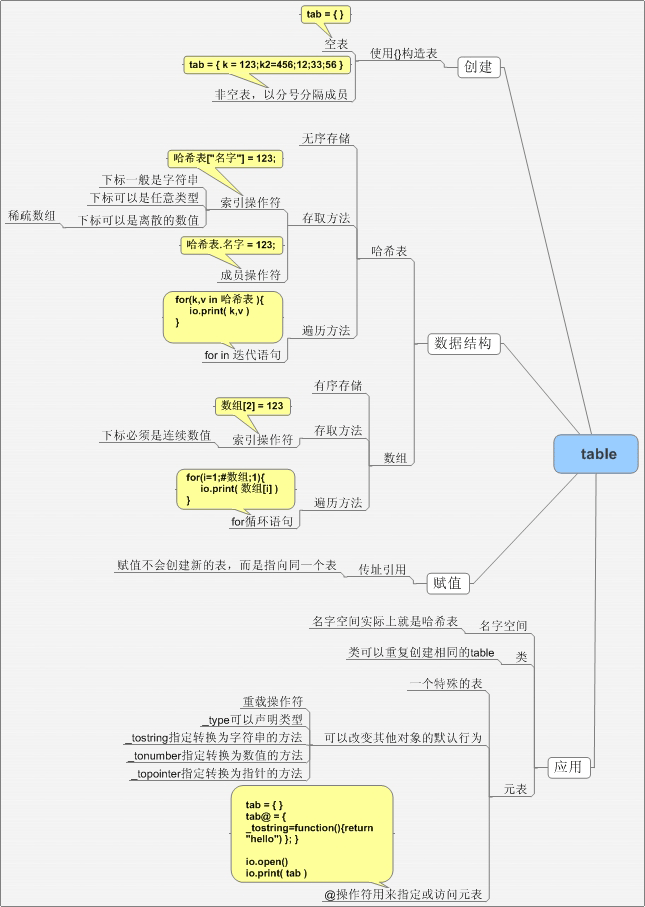

## table(表)

table（表）是aardio中唯一的复合数据类型，除了非复合的基础数据类型以外，aardio中几乎所有的复合对象都是表，即使是变量的命名空间也是表。表的本质是一个集合(collection)，可以用于容纳其他的数据成员，并且表也可以嵌套的包含其他的表（table），在aardio里表几乎可以容纳一切其他对象。

如果我们把字符串、缓冲区(buffer)、数值、函数、指针.....这些基础数据类型比喻为盘子中的菜，那么表这样的复合数据类型就是装菜的盘子，如果没有了盘子，所以就没有办法愉快的吃菜了（相当于在程序代码中传输、使用数据）。


### 一、表的类型

表（table）包含的数据结构也被称为字典(dictionaries)、列表（list）、映射(map)、关联数组(associative arrays)、对象(object)......等等.虽然在不同的编程语言里的具体实现存在差异（例如有序或无序存储、使用或不使用哈希算法），但基本都是用来包含不定个数的键值对成员。

aardio中的表可以包含不定个数的成员，每个成员都由一个键值对组成（键用来指定成员的名称，值用来指定成员的值）。"键"可以任何除null以外的数据类型,甚至可以在table元素中包含table，table允许嵌套。"值"也可以任意数据类型，当值为null时表示删除该成员。

通常把"键"放在索引操作符"[]"中来索引一个元素的值，这时候键又称为"下标"或"索引"。例如 tab["键"] tab[1]，"[]"则被称为下标操作符。也可以把一个符合变量命名规则的键放在成员操作符"."后面,例如 tab.key tab.key2 ;

根据键的存取排序规则，表包含的成员分为以下两种类型（ 表可以同时包含以下两种类型的成员 ）

**a)、哈希表（无序集合）**

aardio中的表是哈希表（hashtable），哈希表使用哈希算法存取，不会按其他特定顺序排序（在代码中添加成员的顺序将被忽略），所以在遍历哈希表时的顺序并不一定会保持代码中书写、添加表成员的顺序，因为我们把这种集合称为无序集合。哈希表的优势是查找速度非常快，即使表包含的成员非常多，仍然可以快速的访问成员键值对。

下面是一个创建哈希表的例子：


tab = {
a = 123;
str =


**b)、数组（有序集合）**

如果表中不定个数的成员的"键"是从1开始、有序、连续的数值，那么这些成员构成一个有序数组。 在创建数组时，数组的键可以省略不写。表总是可以同时包含数组、以及非数组成员， 即使不包含数组成员，我们也可以将表作为空数组处理。

如果表中包含的成员使用了数值作为键，但是多个成员的键并不是从1开始的连续数值 - 则构成稀疏数组。 在aardio一般我们提到的数组 - 如果未加特别说明则是特指有序连续数组（不包含稀疏数组）。

如果表中包含了稀疏数组，或者成员的数值键包含不连续的、中断的数值，那么不应当作为有序数组使用。 aardio中几乎所有针对数组操作的函数或操作符 - 如果未加特别说明都要求参数是有序数组。

有序数组可以使用for循环（或者table.eachIndex）有序的遍历成员，下面我们看一个在aardio中使用数组的简单演示:


### 二、构造表

用{}操作符构造新的table对象，
并以分号;分隔每一个元素 (不能使用逗号代替分号)。如果成员是一个函数并以}或end结束时，可以省略分隔符。

{}操作符在表达式中只能作为赋值语句的右值、函数参数、或被包含在另一个table构造器中，而不允许与其他操作符结合，不允许向前结合、向后结合，仅允许被括号{}[](the%20language/datatype)包含。

创建一个空的table。

var days = {}

创建一个table数组。

var days = {
"Sunday"; "Monday"; "Tuesday"; "Wednesday";
"Thursday"; "Friday"; "Saturday"
}

//days[1] 的内容是
"Sunday".days[2]的内容就是"Monday"......

table元素可以使用各种数据类型的变量，甚至可以是一个表达式或者一个函数，如果我们为table中的值赋于一个键名字，则在table中添加一个键值对。

point = { x=100 ; y=200 }

//point.x 的值是100;point.y 的值是200


可以在一个table中同时包括有序数组、以及其他键值对。

tab = {x=100;y=200;"Sunday"; "Monday"}

//tab.x 的值是100;tab.y 的值是200

table的键名并不要求符合变量命名规则，键可以是任何除null以外的值或字符串。不符合变量命名规则的键名必须置于下标操作符内（并且必须是字符串，例如包含在引号中字面值）。


 在任何时候，table中不符合变量命名规则的键必须通过[]操作符访问，以下是正确的写法：
tab = { [1]=300;[2]=400;["+"]=200;[1+1]=200 }; //因为变量名不能以数字开始,更不能包含运算符。

以上的写法等价于
tab
={};
tab[1]=300;
tab[2]=400;
tab["+"]=200;
tab[1+1]=200;

 我们可以把多个变量用一对花括号包含起来以转换为table数组，也可以通过table.unpack函数将table数组转换为多个变量。

var tab =
{"a";"abc";"abcd"} ; //创建一个table ;
a,b,c = table.unpack (tab);
var tab2 ={ table.unpack (tab)
}; //将所有返回值转换为table变量tab2

### 三、在函数参数中构造表

 当在函数内部有且只有一个使用{}构造器构建的table参数时，并且不包含数组元素，则{}可以省略。

 例如：

``` aau
func( { k = 123 ;  k2=456 }  )
```


 可以省略{}写成如下格式：

``` aau
func( k = 123 ;  k2=456 )
```

### 四、访问table成员

在访问table中的元素时，用元素的键作为下标查询元素的值，例如:

tab = {};

tab [] =;

tab [] =;


 如果"键"是一个数字索引称为"键索引"，如果键是一个字符串称为"键名"
，
 对于符合变量命名规范的键名，可以用"."成员符访问。例如：

``` aau
tab["x"] = 200; 也可以写为 tab.x = 200;
```


 当我们将tab元素赋值为null会删除这个元素。例如：

``` aau
tab.x = null; //删除tab.x
```

### 五、遍历table

遍历table列表中的全部元素

遍历table列表中的数组元素

### 附：table导航图


