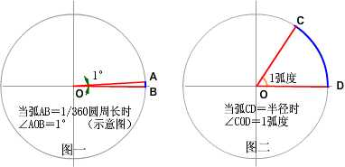

# math库
数学函数库

#### math.size64( 数值低位,数值高位 )
创建64位无符号长整数(无符号指没有负数，即没有符号位)，构造参数可以是一个或两个数值或字符串指定的数值,也可以用于复制其他math.size64创建的对象()，返回值可兼容API类型中的LONG类型(无符号长整数)
注意aardio普通数值表示的有效整数范围在正负 (2**53 - 1) 之间，而math.size64可以使用64个二进制位表示更大的正整数.

示例:

``` aau
var size = math.size64(1,2);
size.add(2);
var size2 = size + 3;
io.open();
io.print( size2.format(),size2 )
```

#### math.randomize( seed=time.tick() )
设置随机数种子，
在使用math.random函数创建随机数以前，
必须调用并且仅调用math.randomize()一次。

参考：[随机数](string/rand.md)

示例:

``` aau
math.randomize()
```

#### math.random(min,max)
获取随机数
参考：随机数

示例:
``` aau
math.random(5, 99) //返回[5,99]之间的随机数
math.random() 返回(0,1)之间的小数
```

#### math.pi
圆周率常量

示例:
``` aau
3.14159265358979323846
```

#### math.abs(x)
取绝对值 |x| = math.abs(x)

示例:
``` aau
math.abs(-20)
```

#### math.ceil(x)
上取整为最接近的整数

math.ceil(x) == ⌈x⌉

``` aau
math.ceil(4.5)
```

#### math.floor(x)
下取整为最接近的整数
math.floor(x) == ⌊x⌋

``` aau
math.floor(4.5)
```

#### math.round(x)
四舍五入取整

``` aau
math.round(4.6) //结果为5
math.round(4.2) //结果为4

math.round = function(n){
  return math.floor(n+0.5)
}
```

**数学知识回顾**
对于所有实数x:
``` txt
x-1 < ⌊x⌋  <= x <= ⌈x⌉ < x+1
```

对于所有整数x:
``` txt
⌊x/2⌋  + ⌈x/2⌉ == x
a % b == a - ⌊a/b⌋ b
```

#### math.sqrt(x)
开平方函数

``` aau
math.sqrt(25)
```

#### math.log10(x)
计算以10为基数的对数

``` aau
math.log10(200)
```

#### math.log(x)
计算一个数字x的自然对数(以e为底)

``` aau
math.log(2.5)
```

**数学知识回顾**
在式子 102 = 100 中
其中10为底数,2为指数,100为幂数
100是10的2次幂， 2是100的对数(以10为底数) 。

1、由底数10,指数2得到幂数100的运算称为乘方运算：

``` txt
10**2 == 100
```

2、由幂数100,指数2得到底数10的运算称为开方运算：
``` txt
100**(1/2) == 10
```

开2次方也可以使用用函数：math.sqrt(100) == 10
3、由底数10,幂数100得到指数2的运算是对数运算：

``` txt
math.log10(100)  == 2
```

在上面的对数运算里，10为底数、100为真数，2为对数。
2是100的对数(以10为底数)。记为：log10100 = 2

以e为底的对象称为自然对数。100的自然对数记为：loge100

e=1+1/1!+1/2!+1/3!+…=2.71828 计为：


“!”表示阶乘符号．通常跟在一个自然数的后面。如：

3!＝3×2×1
5!＝5×4×3×2×1

#### math.exp(x)
计算以e为底x次方值

``` aau
math.exp(2)
```

#### math.ldexp(m,n)
已知尾数m 和指数n ，返回数字x
(方程式：x = m * 2^n)。

``` aau
math.ldexp(5, 3)
```

#### math.frexp(x)
返回数字x 的尾数m 和指数n
(方程式：x = m * 2^n)

``` aau
math.frexp(10)
```

**数学知识回顾**
在aardio中可以使用科学计数法表示数值。

科学计数法将一个数字表示成 ( a * 10的n次幂的形式 ) ，记为：aEn 其中a为尾数，而n为指数。
尾数的范围通常是 1.0 <= |x| < 10.0

例如：
1E+09 表示`1*10的9次方`
1E-02 表示`1*10的负2次方`，即`1*10的2次幂分之一`，即0.01

#### math.max(n,n2,...)
取得数中最大值

``` aau
math.max(2,3,4,5)
```

#### math.max(n,n2,...)
取得参数中最小值

``` aau
math.min(2,3,4,5)
```

#### math.modf(x)
把数分为整数和小数

``` aau
math.modf(23.45)
```

#### math.rad(x)
角度转弧度

``` aau
math.rad(180)
```

#### math.deg(x)
弧度转角度

``` aau
math.deg(math.pi)
```

**数学知识回顾**
“角度”和“弧度”是度量角大小的两种不同的单位。
就像“米”和“市尺”是度量长度大小的两种不同的单位一样。


角度：两条射线从圆心向圆周射出，形成一个夹角和夹角正对的一段弧。当这段弧长正好等于圆周长的360分之一时，两条射线的夹角的大小为1度，（如图一）

弧度：两条射线从圆心向圆周射出，形成一个夹角和夹角正对的一段弧。当这段弧长正好等于圆的半径时，两条射线的夹角大小为1弧度。（如图二）



半圆的长度是半径的 π倍，所以一个平角（180度）是 π弧度。 即：180度＝π弧度

角度＝弧度×180/π
弧度＝角度×π/180

**三 角 函 数**
三角函数（Trigonometric）是数学中属于初等函数中的超越函数的一类函数。它们的本质是任意角的集合与一个比值的集合的变量之间的映射。通常的三角函数是在平面直角坐标系中定义的，其定义域为整个实数域。


直角三角定义：
在数学中，三角函数（也叫做圆函数）是角的函数。三角函数通常定义为包含这个角的直角三角形的两个边的比率 。在平面直角坐标系xOy中，从点O引出一条射线OP，设旋转角为θ，设OP=r，P点的坐标为（x，y）


正弦函数 sinα=y/r
sin:角α的对边 比 斜边 　　

余弦函数 cosα=x/r
cos:角α的邻边 比 斜边 　　

正切函数 tanα=y/x
tan:角α的对边 比 邻边 　　

余切函数 cotα=x/y
cot:角α的邻边 比 对边

正割函数 secα=r/x
sec: 角α的斜边 比 邻边 　

余割函数 cosecα=r/y
cosec: 角α的斜边 比 对边 　　
sinα定义域无穷，值域 [-1,1]
cosα定义域无穷，值域 [-1,1] 即
tanα的定义域(-π/2+kπ,π/2+kπ)，k属于整数，值域无穷

> 在数学中：中括号表示闭区间,小括号表示开区间，例如：
> [-1,1] 表示 -1 <= x and x <= 1
(-1,1) 表示 -1 < x and x < 1
[-1,1) 表示 -1 <= x and x < 1


#### math.sin(x)
正弦函数

``` aau
math.sin(math.rad(35))
```
余割(cosec) 是正弦(sin)的倒数：

cosec(x) == 1/math.sin(x)

#### math.asin(x)

反正弦函数

``` aau
math.asin(0.5)
```

#### math.sinh(x)

双曲线正弦函数

``` aau
math.sinh(0.5)
```

#### math.cos(x)

余弦函数

``` aau
math.cos(0.5)
```

正割(sec) 是余弦(cos)的倒数：

sec(x) == 1/math.cos(x)


#### math.acos(x)

反余弦函数

``` aau
math.acos(0.5)
```

#### math.cosh(x)

双曲线余弦函数

``` aau
math.cosh(0.5)
```

#### math.tan(x)

正切函数

``` aau
math.tan(0.6)
```

#### math.atan(x)

反正切函数

``` aau
math.atan(0.5)
```

余切(cot) 是正切(tan)的倒数：

cot(x) == 1/math.tan(x)

#### math.atan2(y,x)

x / y的反正切值

``` aau
math.atan2(45,25)
```

#### math.tanh(x)

双曲线正切函数

``` aau
math.tanh(0.6)
```


